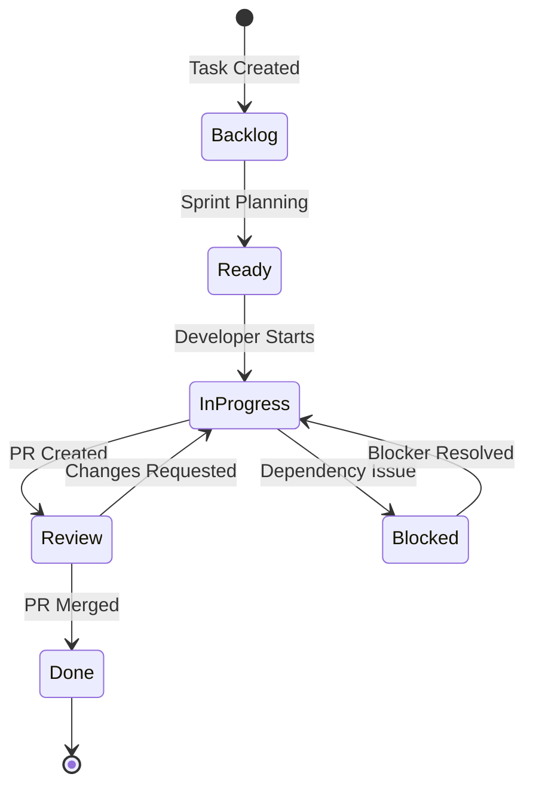

# Git Project Planner - Planning System

## Table of Contents

1. [Introduction](#introduction)
2. [Architecture Overview](#architecture-overview)
3. [File Structure](#file-structure)
4. [GitHub Project Integration](#github-project-integration)
5. [Planning Levels](#planning-levels)
6. [Weekly Workflow](#weekly-workflow)
7. [Task Lifecycle](#task-lifecycle)
8. [Automation](#automation)
9. [Best Practices](#best-practices)
10. [Templates](#templates)
11. [Examples](#examples)
12. [Troubleshooting](#troubleshooting)

---

## Introduction

The Git Project Planner is a hybrid approach to project management that combines:
- **Git files as source of truth** - All specifications, plans, and history in version control
- **GitHub Projects for visualization** - Interactive Kanban boards and progress tracking
- **Minimal automation** - Scripts ---

## Summary

The Git Project Planner provides:

✅ **Clear task tracking** - Always know what to work on
✅ **Historical record** - Git keeps everything
✅ **Visual progress** - GitHub Project boards
✅ **Flexible workflow** - Adapt as needed
✅ **Minimal overhead** - Focus on building, not process

Start simple, add complexity only where it provides value.

---

*Maintainer: Git Project Planner Team*
```ave significant time

### Core Principles

1. **Simple** - Minimum files, clear structure, no unnecessary complexity
2. **Reliable** - Git provides history, backup, and collaboration
3. **Transparent** - Always clear what we're doing, what's next, what's blocked
4. **Iterative** - Start with MVP, add features as needed

### Goals

- **Primary**: Always know what to work on next
- **Secondary**: Track progress and velocity
- **Tertiary**: Identify and resolve blockers quickly

---

## Architecture Overview

```
┌─────────────────┐     ┌──────────────────┐     ┌────────────────┐
│                 │     │                  │     │                │
│   Git Files     │────▶│  GitHub Issues   │────▶│ GitHub Project │
│ (Source of      │     │  (Work Items)    │     │ (Visualization)│
│    Truth)       │     │                  │     │                │
│                 │     │                  │     │                │
└─────────────────┘     └──────────────────┘     └────────────────┘
        ▲                        ▲                        │
        │                        │                        │
        │                   Sync Scripts                  │
        │                  (Optional)                     │
        │                        │                        │
        └────────────────────────┴────────────────────────┘
                         Feedback Loop
```

### Components

1. **Git Files** (`planning/`, `tasks/`)
   - Detailed specifications
   - Sprint plans and summaries
   - Historical record

2. **GitHub Issues**
   - One issue per task
   - Links to task specification files
   - Auto-close on PR merge

3. **GitHub Project**
   - Kanban board visualization
   - Sprint and roadmap views
   - Progress metrics

4. **Automation** (Optional)
   - Sync scripts for consistency
   - CI workflows for auto-updates
   - Progress report generation

---

## File Structure

### Planning Directory

```
planning/
├── README.md                    # Quick start guide
├── roadmap.md                   # High-level milestones
├── current-sprint.md            # ACTIVE SPRINT (main file!)
└── completed-sprints/
    ├── sprint-01-summary.md     # Historical summaries
    ├── sprint-02-summary.md
    └── ...
```

### Tasks Directory

```
tasks/
├── feature-x/                   # Feature-based organization
│   └── TASK-*.md
├── feature-y/
│   └── TASK-*.md
├── planning-system/            # Meta tasks for planning system
│   └── PS-*.md
└── backlog/                    # Unscheduled tasks
    └── *.md
```

### File Purposes

| File | Purpose | Update Frequency |
|------|---------|------------------|
| `roadmap.md` | Quarterly/monthly planning | Monthly |
| `current-sprint.md` | Active work tracking | Daily |
| `sprint-XX-summary.md` | Historical record | End of sprint |
| `tasks/*/XXX-*.md` | Detailed specifications | As needed |

---

## GitHub Project Integration

### Project Setup

1. **Create Project**
   - Name: "Project Development"
   - Visibility: Private (or as preferred)
   - Template: Basic Kanban

2. **Custom Fields**

| Field | Type | Values | Purpose |
|-------|------|--------|---------|
| Status | Select | `Backlog`, `Ready`, `In Progress`, `Review`, `Done` | Workflow state |
| Sprint | Select | `Sprint 1`, `Sprint 2`, `Backlog` | Sprint assignment |
| Priority | Select | `🔥 Critical`, `⚡ High`, `⬆️ Medium`, `⬇️ Low` | Task priority |
| Component | Select | `Core`, `Platform`, `App`, `Integration`, `Docs` | Architecture layer |
| Estimate | Number | 1-16 (hours) | Work estimation |
| Blocker | Checkbox | Yes/No | Blocker flag |

3. **Views**

#### Kanban Board (Default)
- **Columns**: Status field
- **Grouping**: None
- **Sorting**: Priority (desc)
- **Filters**: Exclude Done after 1 week

#### Sprint Board
- **Columns**: Status field
- **Grouping**: Sprint field
- **Filters**: Current sprint only
- **Sorting**: Priority (desc)

#### Roadmap Timeline
- **View type**: Roadmap
- **Date field**: Milestone
- **Grouping**: Component

### Automation Rules

1. **Auto-add to project**: All new issues with `your-project` label
2. **Auto-close**: When PR merged with "Closes #XXX"
3. **Auto-move**: To "Review" when PR created
4. **Auto-archive**: Done items after 2 weeks

---

## Planning Levels

### Hierarchy

```
Roadmap (3 months)
    └── Milestone (2-4 weeks)
            └── Sprint (1 week)
                    └── Task (hours/days)
                            └── Subtask (optional)
```

### Level Details

#### Roadmap Level
- **File**: `planning/roadmap.md`
- **Horizon**: 3 months
- **Updates**: Monthly
- **Example**: "Q4 2024: Foundation & Core Pipeline"

#### Milestone Level
- **File**: `planning/roadmap.md` (section)
- **Duration**: 2-4 weeks
- **Focus**: Major feature or integration
- **Example**: "Milestone 1: Core Pipeline (Oct 1-15)"

#### Sprint Level
- **File**: `planning/current-sprint.md`
- **Duration**: 1 week
- **Tasks**: 3-5 major items
- **Example**: "Sprint 2: Complete correction pipeline"

#### Task Level
- **File**: `tasks/*/*.md`
- **Duration**: 1-16 hours
- **Detail**: Full specification with DoD
- **Example**: "TASK-013: Wire correction pipeline"

---

## Weekly Workflow

### Monday: Sprint Planning

**Morning Ritual** (30 min):

1. **Review last sprint**
   ```bash
   cat planning/completed-sprints/sprint-N.md
   # Note velocity, blockers, learnings
   ```

2. **Update current sprint**
   ```bash
   vim planning/current-sprint.md
   ```
   - Set sprint goal (one sentence)
   - Select 3-5 tasks from backlog
   - Clear previous blockers
   - Add any notes

3. **Sync to GitHub**
   ```bash
   # Manual: Update issues and project board
   # Or automated:
   Scripts/planning/sync-sprint.sh
   ```

4. **Communicate plan**
   - Post sprint goal in project chat (if team)
   - Update project board view

### Tuesday-Thursday: Execution

**Daily Flow**:

1. **Check current work**
   ```bash
   grep "In Progress" planning/current-sprint.md
   ```

2. **Start task**
   - Move card: Ready → In Progress
   - Create feature branch
   - Update current-sprint.md

3. **Work on task**
   - Regular commits
   - Update task file if scope changes

4. **Complete task**
   - Create PR with "Closes #XXX"
   - Move card: In Progress → Review
   - After merge: auto-moves to Done

### Friday: Sprint Review

**Afternoon Ritual** (30 min):

1. **Generate summary**
   ```bash
   cp planning/current-sprint.md \
      planning/completed-sprints/sprint-N.md
   # Add summary section
   ```

2. **Calculate metrics**
   - Tasks completed vs planned
   - Velocity (story points or hours)
   - Blockers encountered

3. **Document learnings**
   - What went well?
   - What was challenging?
   - What to improve?

4. **Prep next sprint**
   - Move incomplete tasks to backlog
   - Identify next priorities

---

## Task Lifecycle

### 1. Task Creation

**Trigger**: New feature, bug, or improvement identified

**Process**:
1. Create task file: `tasks/backlog/XXX-description.md`
2. Use task template (see Templates section)
3. Estimate work (1, 2, 4, 8, 16 hours)
4. Identify dependencies

**Example**:
```markdown
---
task_id: "TASK-013"
title: "Wire correction pipeline"
estimate: "8h"
priority: "High"
dependencies: ["TASK-012"]
---
```

### 2. Task Scheduling

**During Sprint Planning**:
1. Review backlog tasks
2. Check dependencies satisfied
3. Consider priority and capacity
4. Add to current-sprint.md
5. Create GitHub Issue (manual or script)

### 3. Task Execution

**Development Flow**:
```bash
# 1. Start work
git checkout -b feature/task-013-correction-pipeline

# 2. Move card in project
# Ready → In Progress

# 3. Development
# ... write code ...
git add .
git commit -m "feat(TASK-013): Implement word buffering"

# 4. Create PR
gh pr create \
  --title "TASK-013: Wire correction pipeline" \
  --body "Closes #123"
```

### 4. Task Completion

**Merge triggers**:
- PR merged → Issue closed → Card to Done
- Update task file status (manual or CI)
- Included in sprint summary

### 5. Task States



---

## Automation

### Available Scripts

#### 1. create-issues.py
**Purpose**: Sync task files to GitHub Issues

```python
#!/usr/bin/env python3
"""
Scripts/planning/create-issues.py

Parses tasks/**/*.md files and creates/updates GitHub Issues.
Maintains bi-directional links between files and issues.
"""

# Usage:
# python Scripts/planning/create-issues.py [--dry-run]
```

#### 2. sync-sprint.sh
**Purpose**: Generate sprint progress report

```bash
#!/bin/bash
# Scripts/planning/sync-sprint.sh

# Generates text report of current sprint:
# - Tasks in each state
# - Progress percentage
# - Blocker count
# - Time estimates

# Usage:
# ./Scripts/planning/sync-sprint.sh
```

#### 3. generate-report.py
**Purpose**: Create sprint summary

```python
#!/usr/bin/env python3
"""
Scripts/planning/generate-report.py

Creates formatted sprint summary from current-sprint.md
and GitHub Project data.
"""

# Usage:
# python Scripts/planning/generate-report.py --sprint 2
```

### CI Integration (Optional)

#### Sync Workflow
```yaml
# .github/workflows/planning-sync.yml
name: Sync Planning

on:
  push:
    branches: [main]
    paths:
      - 'tasks/**/*.md'
      - 'planning/*.md'
  schedule:
    - cron: '0 9 * * 1'  # Weekly on Monday
  workflow_dispatch:

jobs:
  sync:
    runs-on: ubuntu-latest
    steps:
      - uses: actions/checkout@v4
      - name: Sync Tasks to Issues
        run: python Scripts/planning/create-issues.py
      - name: Update Sprint Status
        run: ./Scripts/planning/sync-sprint.sh
```

---

## Best Practices

### Writing Good Task Descriptions

**DO**:
- ✅ Clear, actionable title
- ✅ Definition of Done checklist
- ✅ Realistic time estimates
- ✅ Link dependencies explicitly

**DON'T**:
- ❌ Vague descriptions
- ❌ Missing acceptance criteria
- ❌ Over-optimistic estimates
- ❌ Hidden dependencies

### Estimation Guidelines

| Estimate | Description | Example |
|----------|-------------|---------|
| 1h | Simple change, well understood | Fix typo, update config |
| 2h | Small feature, clear scope | Add validation, simple API |
| 4h | Medium feature, some complexity | New component, integration |
| 8h | Large feature, multiple parts | Complete pipeline, system |
| 16h | Very large, consider splitting | Major refactor, new system |

### Handling Blockers

**Immediate Actions**:
1. Update current-sprint.md with blocker
2. Set Blocker flag in GitHub Project
3. Document in task file
4. Communicate if team project

**Resolution Strategies**:
- **Technical**: Research, spike, ask for help
- **Dependency**: Work on something else, escalate
- **External**: Document, set reminder, follow up

### Sprint Retrospectives

**Questions to Answer**:
1. What did we complete?
2. What didn't get done and why?
3. What took longer than expected?
4. What went surprisingly well?
5. What should we change next sprint?

**Format**:
```markdown
**Format**:
```markdown
## Sprint N Retrospective

### Completed (4/5 tasks)
- ✅ TASK-012: Coordinator
- ✅ TASK-013: Pipeline
- ✅ PS-001: Documentation
- ✅ PS-002: Setup

### Not Completed
- ❌ TASK-014: Tests (blocked by API change)

### Metrics
- Velocity: 20h estimated, 22h actual
- Accuracy: 90% (good!)

### Learnings
```
- Swift 6 concurrency requires more careful planning
- Documentation-first approach working well

### Actions for Next Sprint
- [ ] Allocate more time for Swift 6 issues
- [ ] Add integration test task for each feature
```

---

## Templates

### Milestone Template
See: [MILESTONE_TEMPLATE.md](./MILESTONE_TEMPLATE.md)

### Sprint Template
See: [SPRINT_TEMPLATE.md](./SPRINT_TEMPLATE.md)

### Task Template
```markdown
---
task_id: "XXX-000"
title: "Task Title"
priority: "High|Medium|Low"
status: "Backlog|Ready|InProgress|Done"
estimate: "Xh"
assignee: ""
sprint: ""
dependencies: []
---

# XXX-000: Task Title

## Objective
Clear, one-sentence objective.

## Background
Context and why this is needed.

## Requirements
- [ ] Requirement 1
- [ ] Requirement 2
- [ ] Requirement 3

## Technical Approach
High-level implementation strategy.

## Definition of Done
- [ ] Code complete and tested
- [ ] Documentation updated
- [ ] PR approved and merged
- [ ] No performance regression
- [ ] Specific acceptance criteria...

## Notes
Additional context, links, decisions.
```

---

## Examples

### Example: Complete Sprint Cycle

#### Monday Morning - Planning
```bash
# 1. Review Sprint 1 summary
$ cat planning/completed-sprints/sprint-01.md
# Velocity: 4 tasks, 24h completed

# 2. Plan Sprint 2
$ vim planning/current-sprint.md
```

```markdown
# Sprint 2: Oct 2-8, 2024

## Sprint Goal
🎯 Complete keyboard correction pipeline end-to-end

## Tasks

### Ready
- [ ] TASK-013: Wire correction pipeline (8h)
- [ ] TASK-014: Integration tests (4h)
- [ ] PS-002: Planning setup (2h)

### Backlog (if time)
- [ ] TASK-015: Performance benchmarks (4h)

## Progress
📊 Completed: 0/3 tasks (0%)
⏱️ Estimated: 14h committed, 4h stretch
```

#### Tuesday - Starting Work
```bash
# Pick up TASK-013
$ git checkout -b feature/task-013-correction-pipeline
# Move card to In Progress in GitHub Project
# Update current-sprint.md status
```

#### Wednesday - Progress Update
```markdown
## Tasks

### In Progress
- [ ] TASK-013: Wire correction pipeline (8h, 50% complete)
  - ✅ Word buffer implemented
  - ⏳ Boundary detection in progress
  - ⏳ CorrectionEngine integration pending
```

#### Thursday - Blocker
```markdown
## Blockers
- TASK-013: CorrectionEngine API changed, need to update integration
  - Action: Review TASK-005 changes
  - Impact: 2h additional work
```

#### Friday - Completion & Review
```bash
# Complete TASK-013
$ git commit -m "feat(TASK-013): Complete correction pipeline"
$ gh pr create --title "TASK-013: Wire correction pipeline" \
               --body "Closes #123"
# PR merged, card moves to Done

# Create sprint summary
$ cp planning/current-sprint.md \
     planning/completed-sprints/sprint-02.md
$ vim planning/completed-sprints/sprint-02.md
# Add retrospective section
```

### Example: Creating New Task

```bash
# 1. Identify need
"We need performance benchmarks for the correction pipeline"

# 2. Create task file
$ vim tasks/backlog/TASK-015-performance-benchmarks.md
```

```markdown
---
task_id: "TASK-015"
title: "Performance benchmarks for correction pipeline"
priority: "Medium"
status: "Backlog"
estimate: "4h"
dependencies: ["TASK-013"]
---

# TASK-015: Performance Benchmarks

## Objective
Establish performance baselines for correction pipeline.

## Requirements
- [ ] Benchmark word detection (<1ms target)
- [ ] Benchmark correction engine (<3ms target)
- [ ] Benchmark full pipeline (<8ms target)
- [ ] Create performance regression test

## Definition of Done
- [ ] Benchmarks implemented with XCTest
- [ ] Baselines documented
- [ ] CI integration configured
- [ ] No existing tests broken
```

```bash
# 3. Create GitHub Issue (optional, can wait for sprint planning)
$ gh issue create \
    --title "TASK-015: Performance benchmarks" \
    --body "See tasks/backlog/TASK-015-performance-benchmarks.md" \
    --label "enhancement,testing"
```

### Example: Handling Urgent Bug

```bash
# 1. Create hotfix task immediately
$ vim tasks/backlog/HOTFIX-001-memory-leak.md

# 2. Add to current sprint (interrupt)
$ vim planning/current-sprint.md
# Add to In Progress section

# 3. Create issue and start work
$ gh issue create --title "HOTFIX: Memory leak in event processor" \
                  --label "bug,critical"
$ git checkout -b hotfix/memory-leak

# 4. Fast track through process
# Work → PR → Review → Merge (same day if critical)
```

---

## Troubleshooting

### Common Issues

#### Issue: Tasks out of sync with Issues
**Symptoms**: Task file says "Ready", Issue says "In Progress"

**Solution**:
```bash
# Run sync script
python Scripts/planning/create-issues.py --sync-status

# Or manually update to match GitHub as source of truth
```

#### Issue: Sprint velocity unclear
**Symptoms**: Not sure how much work to plan

**Solution**:
```bash
# Check last 3 sprints
for i in 1 2 3; do
  grep "Velocity:" planning/completed-sprints/sprint-0$i.md
done

# Average gives reasonable estimate
```

#### Issue: Too many blockers
**Symptoms**: Multiple tasks blocked each sprint

**Solution**:
1. Review dependencies during planning
2. Add "spike" tasks for unknowns
3. Have backup tasks ready
4. Consider smaller task sizes

#### Issue: GitHub API rate limits
**Symptoms**: Scripts fail with 403 errors

**Solution**:
```bash
# Use authentication
export GITHUB_TOKEN="your-token"

# Or reduce sync frequency
# Run weekly instead of daily
```

### Debug Commands

```bash
# Check current sprint status
cat planning/current-sprint.md | grep -E "^- \["

# Count completed tasks this week
gh issue list --state closed \
  --search "closed:>1 week ago" \
  --json number,title | jq length

# Find orphaned tasks (no issue)
for task in tasks/**/*.md; do
  id=$(grep "task_id:" $task | cut -d'"' -f2)
  gh issue list --search "$id in:title" || echo "No issue: $id"
done

# Generate quick status
echo "Sprint Status: $(date)"
echo "In Progress: $(grep -c "In Progress" planning/current-sprint.md)"
echo "Blocked: $(grep -c "Blocker" planning/current-sprint.md)"
echo "Completed this week: $(gh issue list --state closed \
  --search "closed:>1 week ago" --json number | jq length)"
```

---

## Migration from Current System

### Phase 1: Documentation (Current)
- ✅ Create this documentation
- ✅ Create task templates
- ✅ Get team buy-in

### Phase 2: Setup (Next)
1. Create planning/ directory structure
2. Migrate current tasks to new format
3. Create initial sprint plan
4. Setup GitHub Project

### Phase 3: Run Trial (Week 1)
1. Use system for one sprint
2. Daily updates to current-sprint.md
3. End-of-sprint retrospective
4. Adjust based on feedback

### Phase 4: Refinement (Week 2+)
1. Add automation where helpful
2. Refine templates
3. Establish rhythm
4. Consider team scaling

---

## Future Enhancements

### Planned Improvements
- [ ] Automated sprint reports
- [ ] Velocity tracking dashboard
- [ ] Slack/Discord integration
- [ ] Time tracking integration
- [ ] Burndown charts

### Feedback Welcome
- What's working well?
- What's friction?
- What's missing?
- File issues at: github.com/mnemoverse/git-project-planner/issues

---

## Summary

The Git Project Planner provides:

✅ **Clear task tracking** - Always know what to work on
✅ **Historical record** - Git keeps everything
✅ **Visual progress** - GitHub Project boards
✅ **Flexible workflow** - Adapt as needed
✅ **Minimal overhead** - Focus on building, not process

Start simple, add complexity only where it provides value.

---

*Last Updated: January 2025*
*Version: 1.0*
*Maintainer: Git Project Planner Team*
